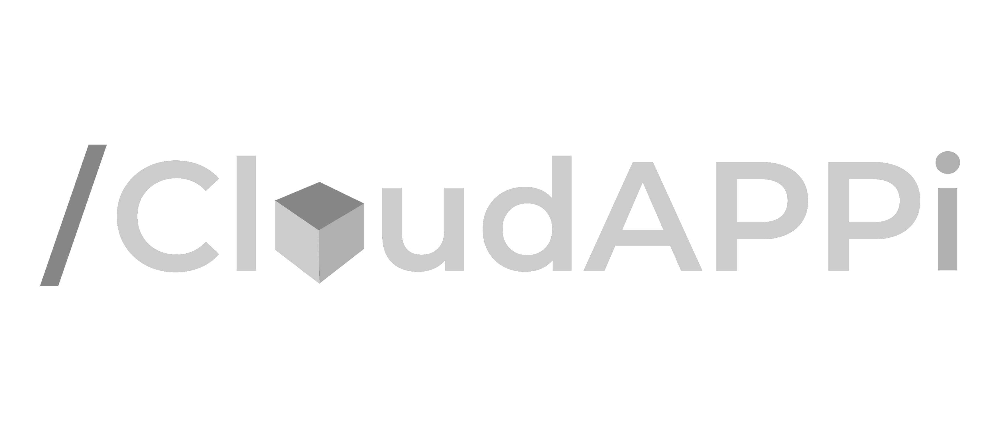
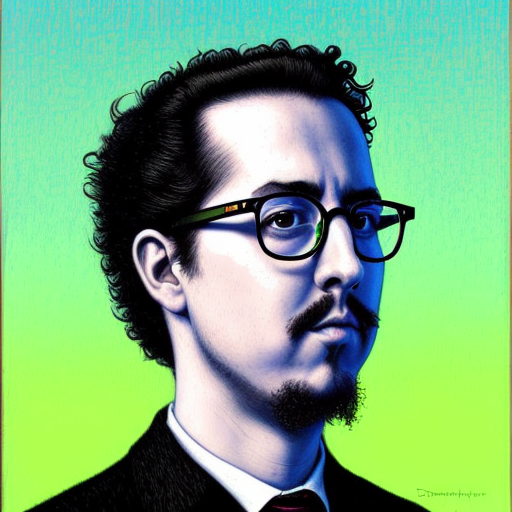
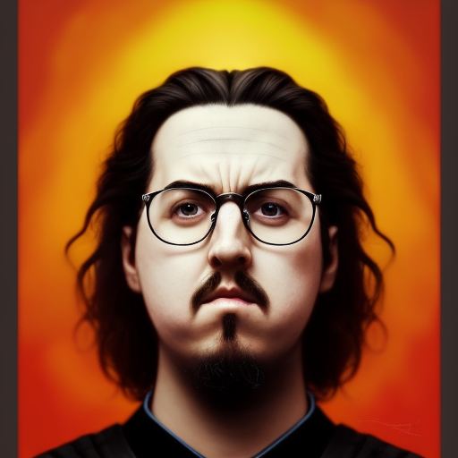
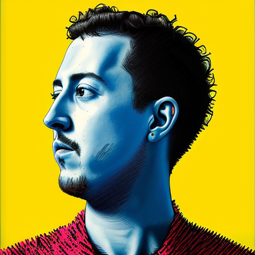
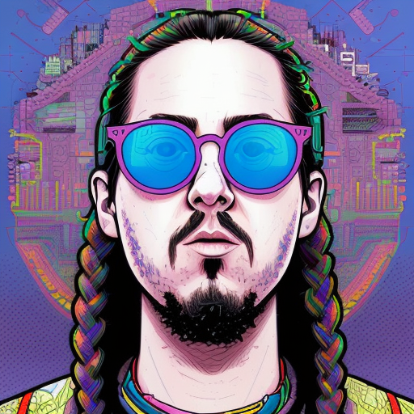
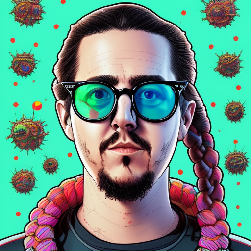
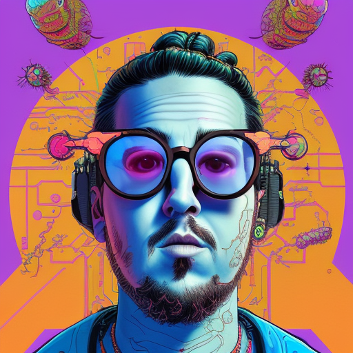
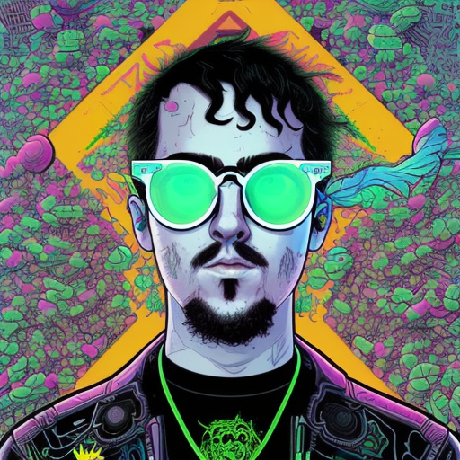
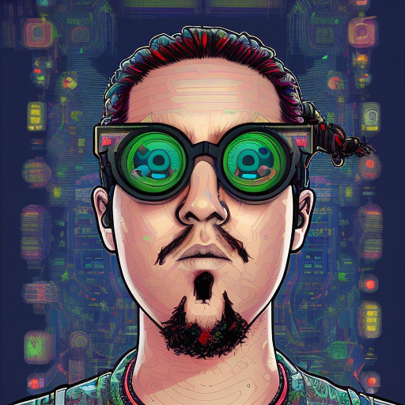

# 🖖 Hi, I'm Dani Jerez
## 👨‍💻 Dev & 👨‍🎨 Artist ☕🐍🍩  

### 🧙‍♂️ `Languages`

### 📱 `Technologies`

### 🧮 `Databases`

###  🌼 `Organizations`

 
 
 

  

 
 ## 🚧 *petit* `projects`

  
  <table>
   <tr>
      <td><a href="https://github.com/danijerez/doorbell_alexa">🔔 doorbell alexa</a></td>
      <td>arduino device that notifies with alexa when the doorbell rings</td>
      <td></td>
      <td></td>
   </tr>

   <tr>
      <td><a href="https://github.com/danijerez/voicemask">🎭 voicemask</a></td>
      <td>arduino electronic mask that shows expressions in led matrix according to sound</td>
      <td></td>
      <td></td>
   </tr>
   
   <tr>
      <td><a href="https://github.com/danijerez/voicemask">🎅 sensor pir</a></td>
      <td>arduino device that notifies with alexa when there is movement</td>
      <td></td>
      <td></td>
   </tr>
   
   <tr>
      <td><a href="https://github.com/danijerez/voicemask">⌛ hourglass</a></td>
      <td>ardunino device digital hourglass</td>
      <td></td>
      <td></td>
   </tr>
   
   <tr>
      <td><a href="https://danijerez.github.io/koloro">🎨 koloro</a></td>
      <td>web to download drawings for colors (pokemon, digimon, etc)</td>
      <td></td>
      <td></td>
   </tr>
   
   <tr>
      <td><a href="https://github.com/danijerez/updater">📦 updater</a></td>
      <td>little solution to update apps</td>
      <td></td>
      <td></td>
   </tr>
   
</table>

 

 
  

  
 ## 🤖 `me` stable diffusion
 

 

